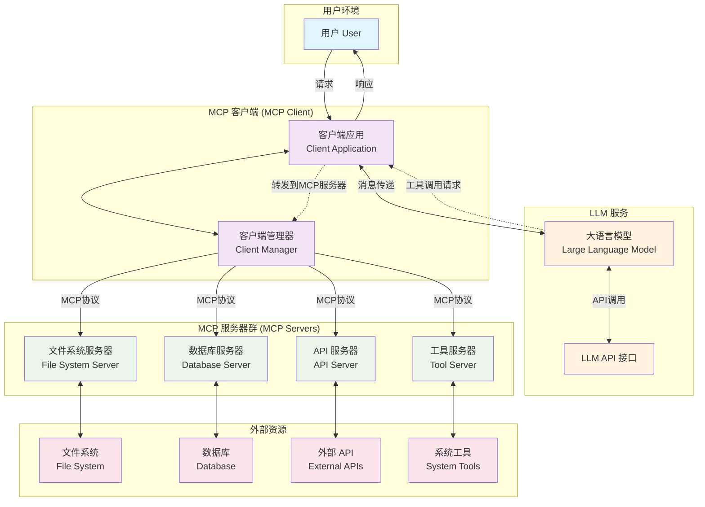
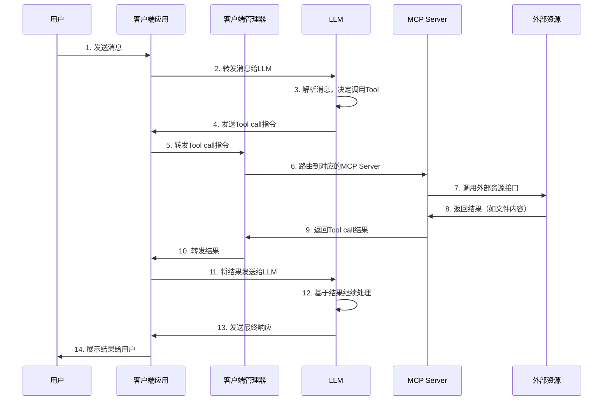

# MCP结构得简要说明

## 结构图

*下图使用Claude生成。*  
*下图使用mermaid插件渲染，可能需要点时间才会出现图片*

## 信息拆解

上图主要由五个部分组成：
- 用户
- LLM
- MCP Client (客户端)
- MCP Servers (服务器群)
- 外部资源， 如数据库，文件系统

下面三个部分，我们基本上都是已知得，所以跳过：
- 用户
- LLM
- 外部资源

所以关键点就剩下了两个： 
- MCP Client (客户端)
- MCP Servers (服务器群)

由上图可以得知， 一个MCP Server 得核心作用就是和外部资源打交道。  MCP Server 应该是定义了一堆 Tool/Function 然后LLM 会调用这些 Tool。 这个功能一般叫做函数调用，  目前主流得LLM 都支持函数调用， 比如 gpt4o, gpt4.1, o4-mini, claude sonnet 4, gemini, deepseek v3/r1 等模型。 

虽然MCP Server 提供了这些 Tools， 但是 MCP Server 自身并不直接和LLM 打交道。  两者中间存在一个MCP Client的模块， MCP Client分成两个部分，一个是客户端应用，一个是客户端管理器。 MCP Client 得核心作用就是连接LLM, 用户和MCP Servers 。

客户端管理器避免了每个客户端应用都需要连接到所有得MCP Servers。 其主要功能就是聚合所有得MCP Servers ， 然后提供接口给 客户端应用。  这样做得一个好处是 假如有3个客户端应用， 那么在新增一个MCP Server 得时候， 就只需要在客户端管理器得地方新增配置就可以了，否则3个客户端都需要添加。 

整体结构得大概运行流程是： 

文字解释说明： 
- 用户发送消息给客户端应用
- 客户端应用将消息发送给LLM， LLM解析之后决定调用某个Tool， 比如读取文件 /home/abc/1.txt 得内容
- LLM将 Tool call 指令发送客户端应用
- 客户端将 Tool call 指令发送给 客户端管理器， 然后客户端管理器找到 Tool call 对应得MCP Server 随后转发过去
- MCP Server 调用 外部资源得接口， 比如文件读取接口获取到文件内容。 随后将文件内容一路转发到LLM 
- LLM 根据 Tool call 调用得结果继续“思考” 然后将响应发送给客户端应用
- 客户端应用将结果展示给用户

---

> 作者: Aincvy  
> URL: https://fantasyplayer.link/periphery/mcp%E7%BB%93%E6%9E%84%E5%BE%97%E7%AE%80%E8%A6%81%E8%AF%B4%E6%98%8E/  

